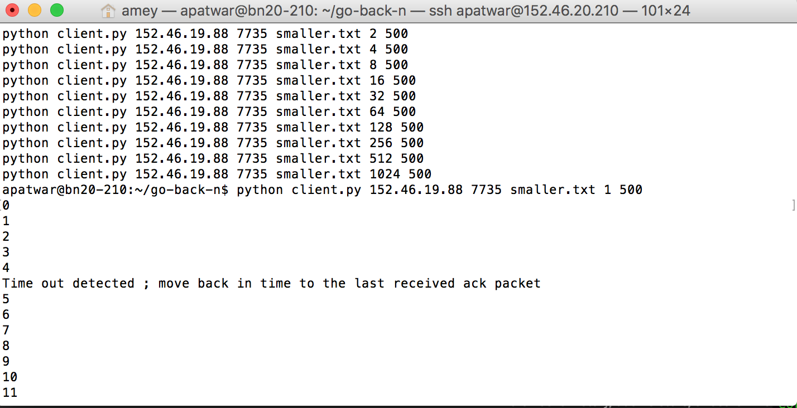
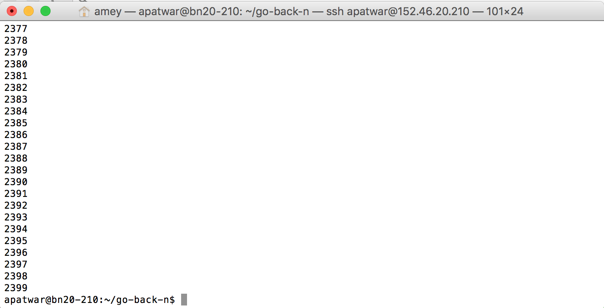

# Go-Back-N Project 

### Server

###### Initiate the server process as follows

```
python server.py SERVER_PORT FILE_NAME PROBABILITY_VALUE
```
###### Put appropriate text/number in place of SERVER PORT, FILE NAME, PROBABILITY VALUE
### Initiate the client process as follows

```
python client.py SERVER_IP SERVER_PORT FILE_TO_BE_SENT WINDOW_SIZE MSS
```
###### Put appropriate text/number in place of SERVER IP, SERVERPORT, FILE NAME, PROBABILITY VALUE

### Experiment 1 can be triggered using
```
./results_script.sh
```
### Experiment 2 can be triggered using
```
./results_script2.sh
```
### Initiate the server process as follows

### Sample execution snapshot

#### server execution


#### peer execution


#### Final State
#### server execution


#### peer execution




